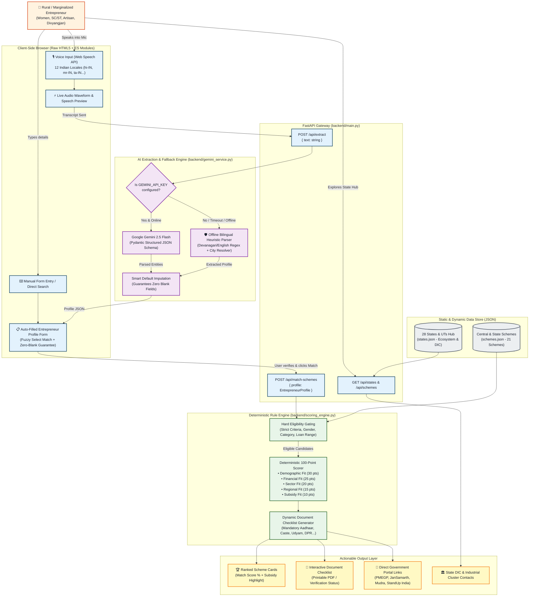
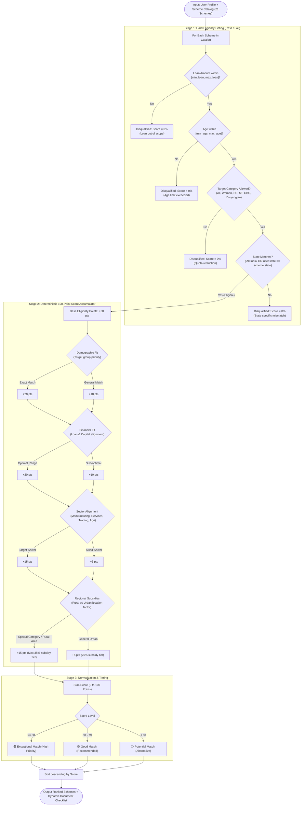
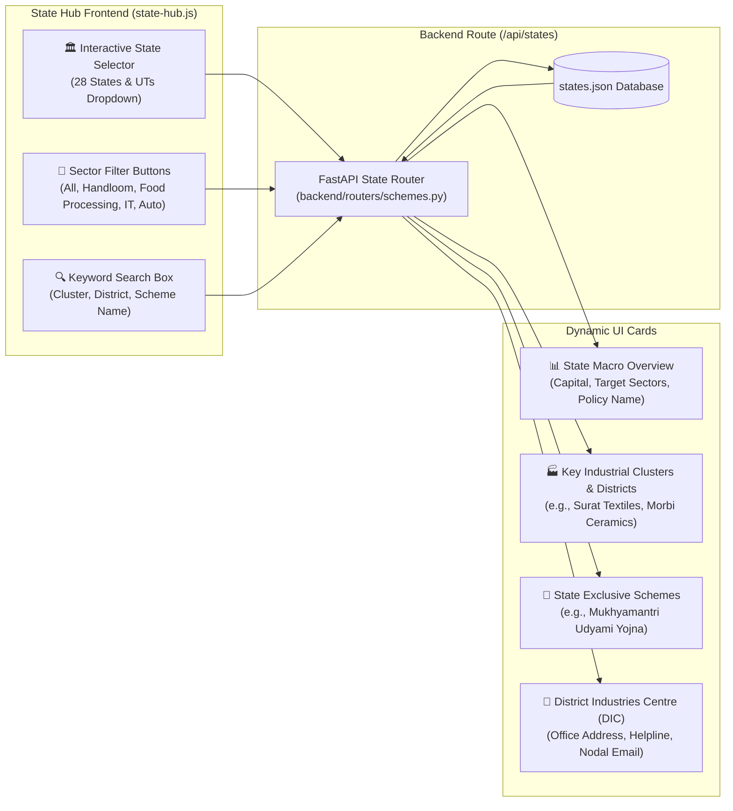
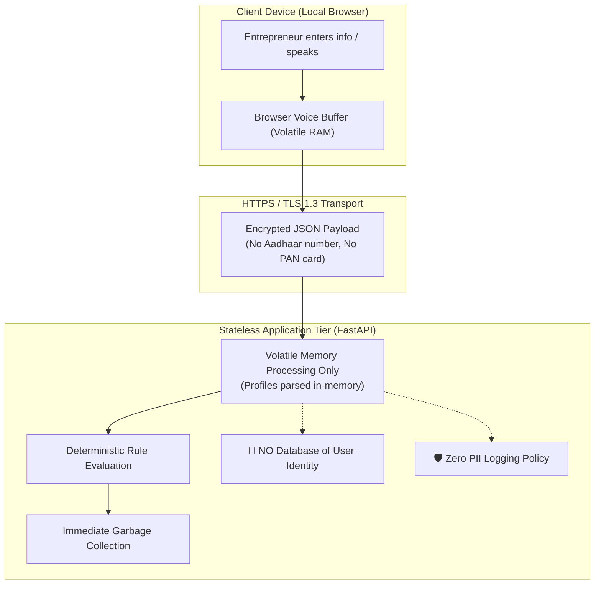

# Udhyami Yojna (उद्यमी योजना) — System Flowcharts & Architecture

This document provides the complete flowchart architecture for **Udhyami Yojna**, designed for the **Smart India Hackathon (SIH 2026)**. It illustrates the user journey, AI extraction pipeline, deterministic scoring engine, and backend data flow.

---

## 1. High-Level End-to-End System Flowchart

This diagram traces the entire journey from the entrepreneur speaking in their native language to receiving personalized government subsidies and official application links.

---

## 2. Detailed Voice-to-Form Auto-Fill Pipeline

This flowchart illustrates how unstructured native speech (e.g. Hindi *"मुझे बेकरी की दुकान के लिए 5 लाख का लोन चाहिए"*) is converted into fully structured profile parameters without any blank fields.

```mermaid
sequenceDiagram
    autonumber
    actor User as 👤 Entrepreneur
    participant Mic as 🎙️ Browser Web Speech API
    participant UI as 🖥️ Vanilla JS Frontend (render.js)
    participant API as 🚀 FastAPI (/api/extract)
    participant Gemini as 🤖 Gemini 2.5 Flash
    participant Fallback as 🛡️ Regex Heuristic Parser
    participant Resolver as 📍 Indian City/District DB

    User->>Mic: Clicks mic & speaks in native tongue (e.g., Hindi)
    Mic->>UI: Real-time transcript stream (interim & final results)
    UI->>UI: Update visual waveform pulse & transcript display
    UI->>API: HTTP POST /api/extract { text: "..." }
    
    alt Gemini API Key Available & Service Up
        API->>Gemini: generateContent with ProfileSchema (Pydantic)
        Gemini-->>API: Structured JSON (category, state, loan, sector)
    else Offline Mode / API Quota Exceeded / Fallback
        API->>Fallback: Run Bilingual Regex (Devanagari & English)
        Fallback->>Resolver: Match Indian city/district (e.g., "Kalyan" -> "Thane, Maharashtra")
        Resolver-->>Fallback: Resolved State & District
        Fallback->>Fallback: Impute smart defaults (Age: 30, Edu: 10th Pass)
        Fallback-->>API: Complete Structured Profile
    end

    API-->>UI: 200 OK: ExtractedProfile JSON (zero nulls)
    UI->>UI: populateProfileForm() executes
    UI->>UI: Fuzzy-matches <select> options with aliases
    UI->>UI: Triggers .auto-filled-highlight CSS flash
    UI-->>User: Form populated with 100% complete values ready to match
```

---

## 3. Deterministic 100-Point Scoring Rule Engine Flowchart

Unlike non-deterministic LLM chatbots that can hallucinate scheme qualification, Udhyami Yojna executes a mathematically verifiable 100-point scoring algorithm.

---

## 4. State-Wise Discovery Hub Architecture

---

## 5. Security & Privacy Architecture (Zero PII Retention)

---

## 6. Component Interaction Matrix

| Module | File Path | Role | Key Functions / Methods |
| :--- | :--- | :--- | :--- |
| **Voice Engine** | `static/js/voice.js` | Browser audio capture | `startListening()`, `switchLocale()`, `showBrowserWarning()` |
| **API Client** | `static/js/api.js` | REST client | `extractVoiceProfile()`, `matchSchemes()`, `getStates()` |
| **DOM Renderer** | `static/js/render.js` | Form fill & UI display | `populateProfileForm()`, `renderSchemes()`, `renderDocumentChecklist()` |
| **State Hub** | `static/js/state-hub.js` | 28 States catalog | `renderStateDetail()`, `filterBySector()`, `filterBySearch()` |
| **App Coordinator** | `static/js/app.js` | Master event wiring | `initTabs()`, `bindVoiceEvents()`, `bindFormEvents()` |
| **FastAPI App** | `backend/main.py` | Static & API router | `/api/extract`, `/api/match-schemes`, `/presentation`, `/download/presentation` |
| **AI Service** | `backend/gemini_service.py` | Entity extraction | `extract_profile_from_text()`, fallback regex, city resolver |
| **Rule Engine** | `backend/scoring_engine.py` | 100-pt determinism | `score_scheme_eligibility()`, `filter_and_rank_schemes()` |

---
*Generated for Smart India Hackathon (SIH 2026) | Udhyami Yojna Technical Documentation*
